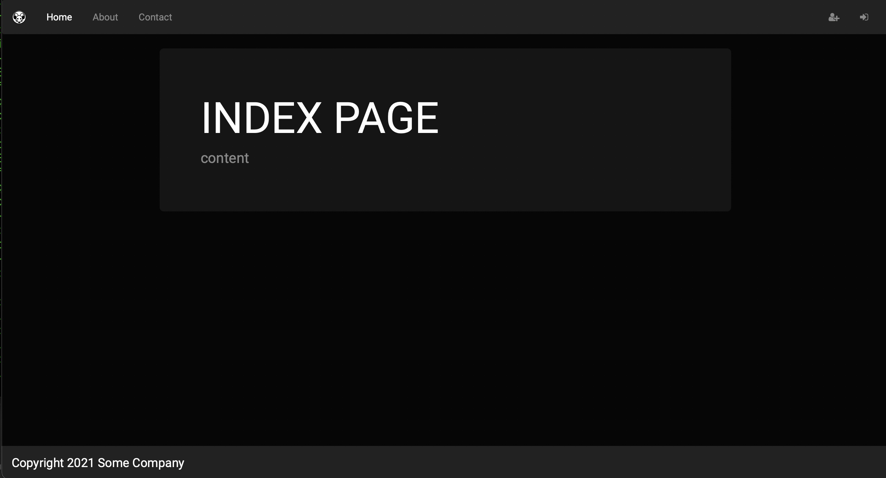
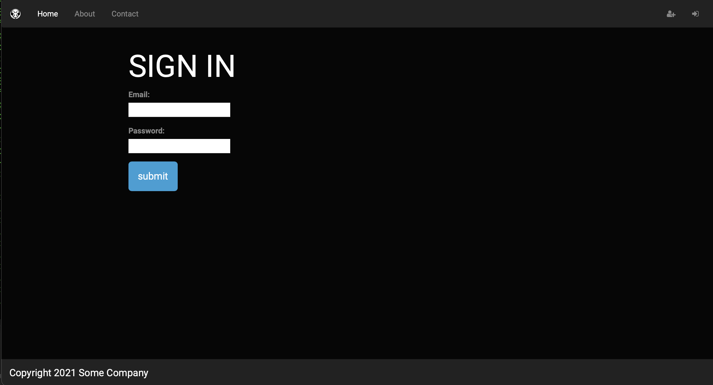
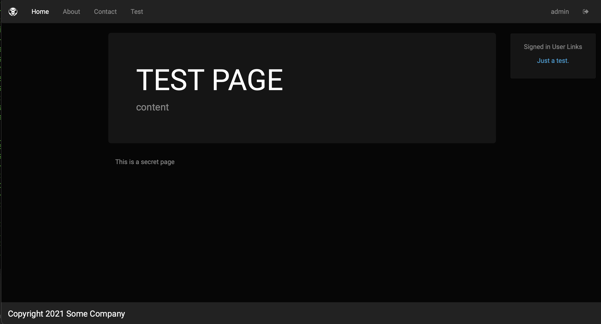
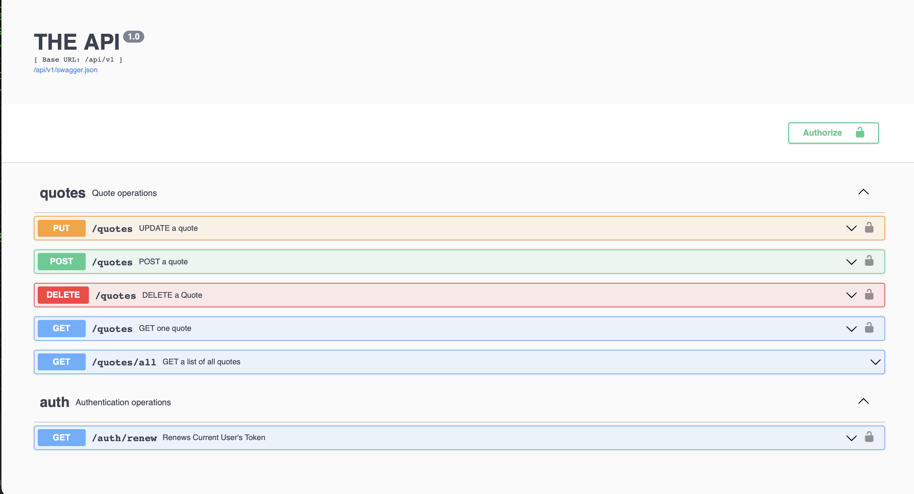

# flask_app_boiler

A simpler Flask boilerplate app

The purpose of this repo is to build a simple boilerplate to deploy web ideas rapidly.

# Features
- Flask Setup for expansion via MVC
    + Default site pages controlled with Flask Blueprints [app/home folder]
    + Local user authentication built in [app/auth folder].
    + DB controlled by SQLAlchemy [SQLite by default]
    + API CRUD operations [Flask-RestX]
      + Now with an example Quotes table in the database
      + Authentication with API tokens

- Bootstrap Themes via Bootswatch CDN
    + Just change out the link in `app/templates/base.html`
    + https://www.bootstrapcdn.com/bootswatch/

# Install

    git clone https://github.com/ephergent/flask_app_boiler.git
    cd flask_app_boiler
    virtualenv -p python3 venv
    source venv/bin/activate
    pip install -r requirements.txt

*[Note: See an example .env file below]*

    source .env

### Use manage.py to work with the system:

Create the DB tables

    python manage.py --create_db

Create an admin user

*[note: edit environment variables for admin example user]*

    python manage.py --create_admin

Drop the DB tables, if you need to start over

    python manage.py --drop_db

### Run it

    python run.py

Open `http://127.0.0.1:5000/` in browser of choice.

Connect to the API `http://127.0.0.1:5000/api/v1` for the Swagger interface.

### Screenshots

#### Example .env file

    # Basic Flask stuff
    export FLASK_APP=run.py
    export FLASK_CONFIG=development
    
    # DB Stuff
    # TBD
    
    # Admin info
    export ADMIN_USER=admin
    export ADMIN_PASSWORD=super_secret
    export ADMIN_EMAIL=admin@example.com

    # Secrets
    # Default: MD5 of "secret"
    export SALTY_SECRET=5ebe2294ecd0e0f08eab7690d2a6ee69
